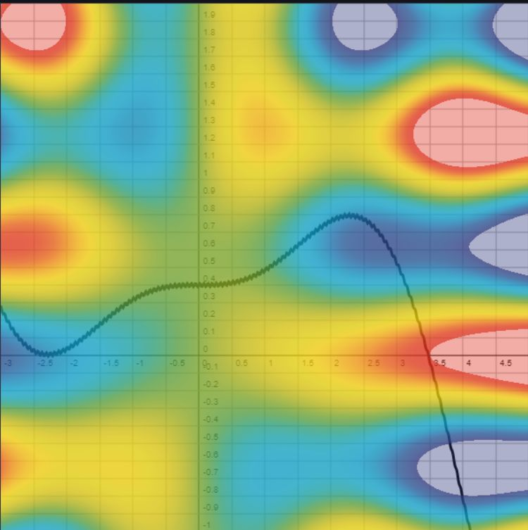

## Introduction
This project collects some plotting functions for drawing on HTML-Canvas.

* [Grid Example](https://fennstef.github.io/graphplot/exampleGrid1.html) 
* [2D-Function Example](https://fennstef.github.io/graphplot/exampleFunction2d.html)
* [3D-Function Example](https://fennstef.github.io/graphplot/exampleFunction3d.html)

### Lecture Interpolation
* [Nearest-neighbor Interpolation](https://fennstef.github.io/graphplot/lecture/interpolation/nearest-neighbor-interpolation.html) 
* [Nearest-neighbor Interpolation 2D](https://fennstef.github.io/graphplot/lecture/interpolation/nearest-neighbor-interpolation-2d.html) 
* [Linear Interpolation](https://fennstef.github.io/graphplot/lecture/interpolation/linear-interpolation.html)
* [Spline Interpolation](https://fennstef.github.io/graphplot/lecture/interpolation/spline-interpolation.html)
* [Inverse Distance Weighting](https://fennstef.github.io/graphplot/lecture/interpolation/inverse-distance-weighting.html)
* [Inverse Distance Weighting 2D](https://fennstef.github.io/graphplot/lecture/interpolation/inverse-distance-weighting-b2d.html)
* [Radial Basis Function Interpolation](https://fennstef.github.io/graphplot/lecture/interpolation/radial-basis-function-interpolation.html)
* [Radial Basis Function Interpolation 2D](https://fennstef.github.io/graphplot/lecture/interpolation/radial-basis-function-interpolation-2d.html)
* [Gausian Process Interpolation](https://fennstef.github.io/graphplot/lecture/interpolation/gausian-process-interpolation.html)
